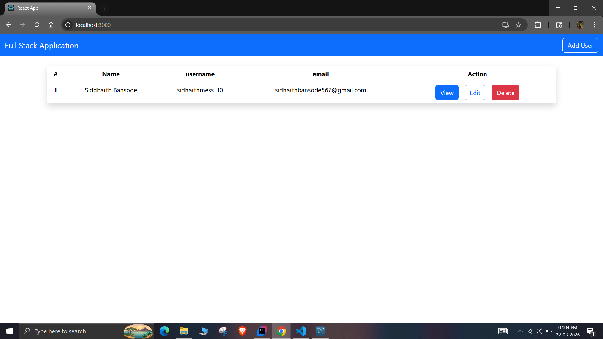

"# fullstack-user-management-system" 

# Spring Boot + React CRUD Application

This is a full-stack web application that performs CRUD (Create, Read, Update, Delete) operations using a React frontend and a Spring Boot backend. The application enables users to manage data efficiently through a structured user interface and RESTful APIs.

## Tech Stack

* Frontend: React.js, JavaScript, HTML, CSS
* Backend: Java, Spring Boot, Hibernate (JPA)
* Database: MySQL (MySQL Workbench)
* API Communication: REST APIs

## Features

* Create new records
* Retrieve and display records
* Update existing records
* Delete records
* Integration between frontend and backend using REST APIs

## Project Structure

```
project-root/
│
├── frontend/        # React application
├── backend/         # Spring Boot application
├── database/        # SQL scripts
```

## Setup Instructions

### 1. Clone the Repository

```
git clone https://github.com/your-username/your-repo-name.git
```

### 2. Setup Backend (Spring Boot)

* Open the backend folder in IntelliJ IDEA
* Configure MySQL database connection in `application.properties`
* Run the Spring Boot application

### 3. Setup Frontend (React)

```
cd frontend
npm install
npm start
```

### 4. Setup Database

* Open MySQL Workbench
* Create a database
* Import the SQL file from the `database` folder

## API Endpoints (Sample)

* GET /api/... → Retrieve all records
* POST /api/... → Create a new record
* PUT /api/... → Update an existing record
* DELETE /api/... → Delete a record

## Description

This project demonstrates the development of a full-stack CRUD application by integrating a React-based frontend with a Spring Boot backend and a MySQL database. The backend follows a layered architecture using controllers, services, and repositories, while the frontend is built using reusable components.

## Future Improvements

* Implement authentication and authorization (JWT)
* Enhance user interface and user experience
* Deploy the application on a cloud platform




